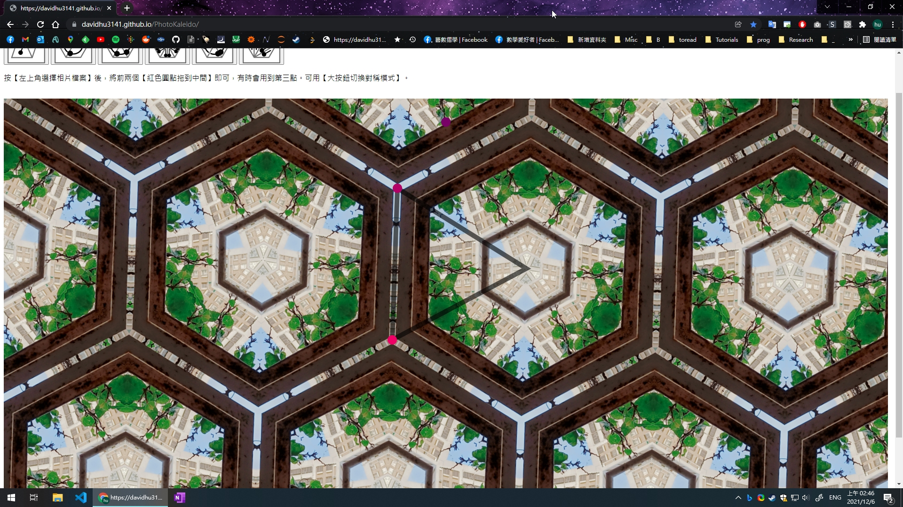

PhotoKaleido
============

輸入照片可生成萬花筒或各種平面對稱。
Generate kaleidoscope or other plane symmetry from images.

Play now: https://davidhu3141.github.io/PhotoKaleido/
Thank you for visiting.

使用方式
-------

1. 點選左上角，選擇相片檔案
2. 將紅色、紫色圓點拖曳到畫面中央即可
    - 除第一種對稱之外只用到兩個點，第三個點會沒用。
3. 大按鈕可選擇不同對稱性
    - 按按鈕沒反應的話拖動圓點就看得到改變

Select a photo file, then drag the red dots onto the photo.

其他事項
-------

- 本程式寫得頗粗糙，有問題歡迎反映，其他錯誤請試試 F5 重整。
- 不確定在舊電腦上是否為會卡頓。這部分可以再改善。
- 本程式並不會收集你的個資，照片也不會上傳，請安心使用。